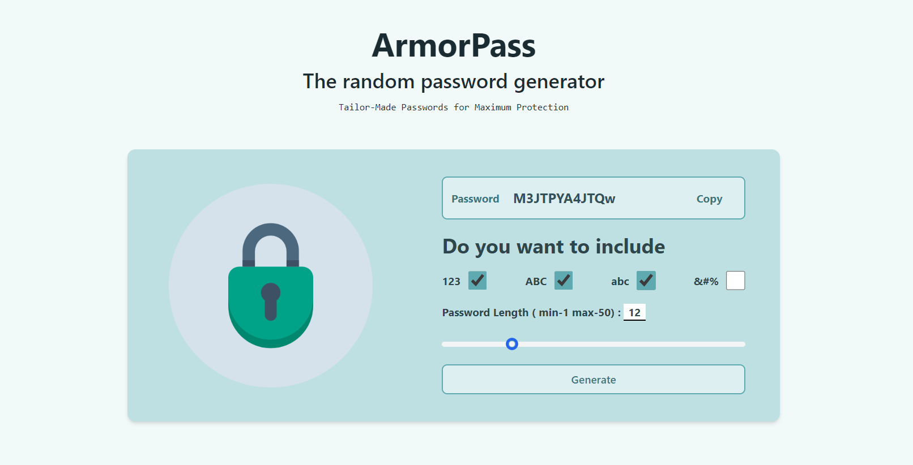

# ArmorPass - Random Password Generator

ArmorPass is a random password generator web application designed to create strong and secure passwords for various uses.

## Features

- Generate random passwords with customizable options:
  - Include numbers (123)
  - Include uppercase letters (ABC)
  - Include lowercase letters (abc)
  - Include special characters (&#%)
- Adjust password length from 1 to 50 characters using a slider.
- Copy generated passwords to the clipboard with a single click.
- Responsive design for use on both desktop and mobile devices.

## Demo

For a live demo, visit [ArmorPass Demo](https://armorpass.netlify.app/).

## Screenshots



## Getting Started

To get a local copy up and running follow these simple steps:

### Prerequisites

You need a modern web browser and a text editor.

### Installation

1. Clone the repository:
   ```bash
   git clone https://github.com/santoshjogdand/ArmorPass.git
   ```
   
2. Navigate into the project directory:
   ```bash
   cd ArmorPass
   ```

3. Open `index.html` in your preferred browser.

## Usage

1. Adjust the checkboxes to select the types of characters to include in the password.
2. Use the slider to choose the desired length of the password.
3. Click on the "Generate" button to create a random password.
4. Click on the "Copy" button next to the generated password to copy it to your clipboard.

## Technologies Used

- HTML
- TailwindCSS
- JavaScript
- Netlify

## Contributing

Contributions are welcome! Please follow these steps to contribute:

1. Fork the Project
2. Create your Feature Branch (`git checkout -b feature/AmazingFeature`)
3. Commit your Changes (`git commit -m 'Add some AmazingFeature'`)
4. Push to the Branch (`git push origin feature/AmazingFeature`)
5. Open a Pull Request

## License

Distributed under the MIT License. See `LICENSE` for more information.

## Contact

Santosh Jogdand - [@santoshjogdand](https://github.com/santoshjogdand/)

Project Link: [https://github.com/santoshjogdand/ArmorPass.git](https://github.com/santoshjogdand/ArmorPass.git)